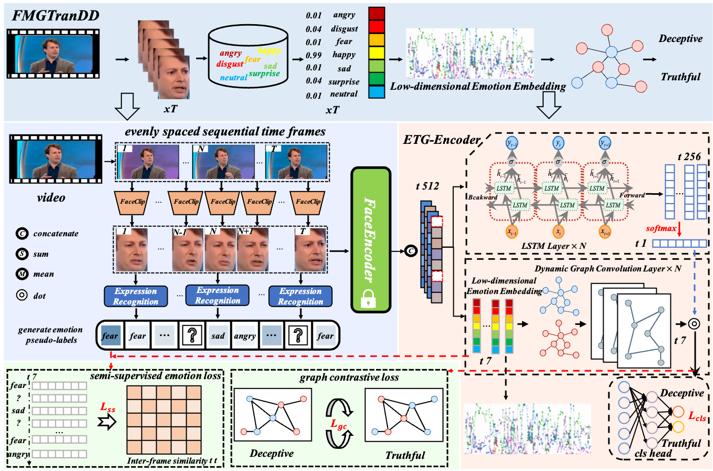

# FMT-VDD: Video-Only Deception Detection from Facial Emotion Trajectories

#### algorithm framework diagram

The environment for our code can execute the following command:
`
pip install -r requirements.txt
`

## Citation
* If you find it helpful for you, please consider citing our paper 📝 and giving a star ⭐.

###### We will update more details after the paper is accepted.
